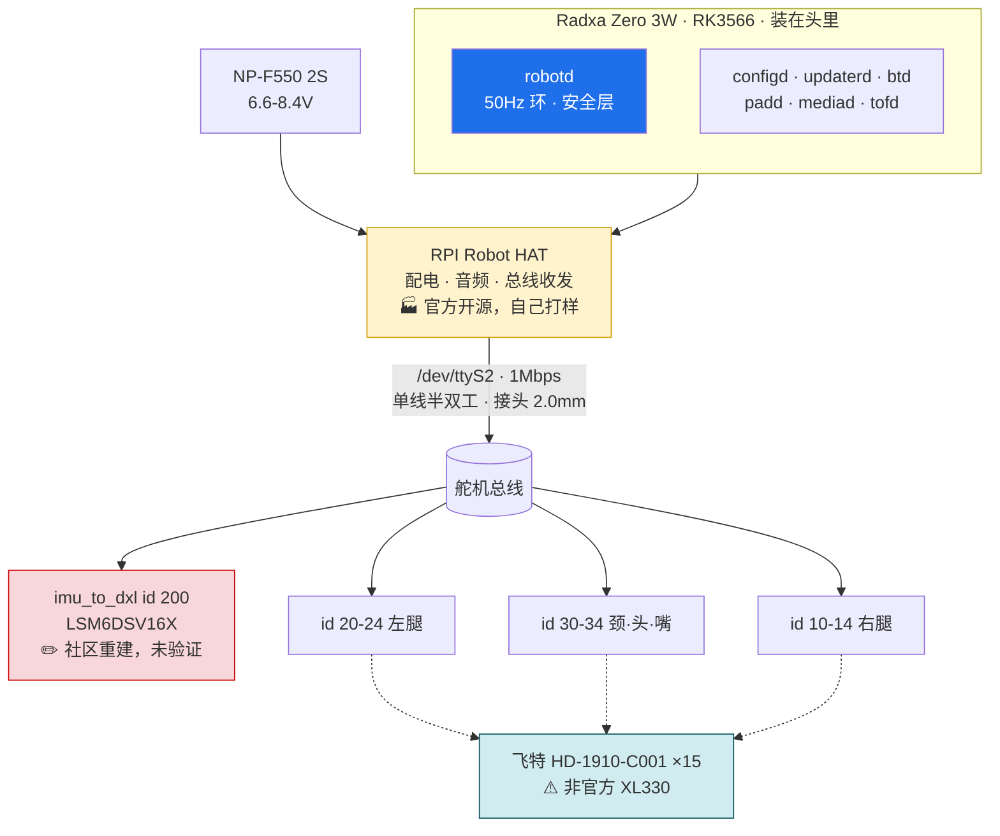

# AGENTS.md

> 本文件与 `.claude/skills/**` 由人维护，智能体不得编辑。需要变更时提出 diff 并停下。

## 产品

从零复刻 Microduck —— Pollen Robotics / Hugging Face 的 $399 双足鸭形机器人。无实机，纯自制。

**参考路线：`fanhao375/microduck-replica`。** 跑官方 Rust 栈，舵机换国产飞特 HD-1910，两块板自己打样。

- `software/` —— 控制栈与 RL 训练。官方栈是 Apache-2.0，这条线是**改造 + 重训**，不是逆向。
- `hardware/` —— 机械与电子。官方未发布设计文件，这条线是**真逆向**。
- `docs/` —— 两条线共享的事实基线。

## 技术

工具链跟随上游：**Rust**（控制栈）+ **Python**（RL 训练）。上游为 `pollen-robotics/microduck`（Apache-2.0）与 `pollen-robotics/microduck_rl`（Apache-2.0）。

当前仓库**无项目代码、无构建配置、无测试、无 CI**，处于规划阶段（`tools/checks/` 下有校验脚本，但不构成构建体系）。看到本节与实际不符时，说明代码已经开始落地 —— 按 harness-review 流程更新本文件。

检查脚本：`python3 tools/checks/check-links.py` 校验所有 markdown 的相对链接与锚点。

上游接入方式（submodule / fork / 脚本拉取）**尚未决定**，定了之后写进本节与目录地图。

⚠️ **舵机换飞特带来两处软件工作**：总线协议模块要换（`rustypot` 有 `Sts3215PyController` 但**无 HD-1910 的类**，兼容性未验证），且**官方 9 个 ONNX 策略全部作废，要按 HD-1910 重训**。

## 结构

两条线并行，耦合点在 `docs/`：

- **软件线不依赖硬件线。** 官方 `scripts/duck-sim` 能让真实 daemon 跑在 MuJoCo 的身体上，所以无实机也能把软件线推到底。
- **硬件线部分依赖软件线。** 几个卡 BOM 的问题只能靠读官方源码回答，不能靠推测。见 `docs/open-questions.md`。
- **许可证按目录分区**：根 Apache-2.0，`hardware/` CC BY-NC-SA 4.0。见下方「约定」。

### 本项目整机架构

跑的是官方 Rust 栈 —— 七个 daemon 经 unix socket 上的 JSON-RPC 通信，只有 `robotd` 能碰电机，50 Hz 控制环独占一条串口总线。

**官方原版的完整资料见 [docs/official/](docs/official/README.md)** —— 一页纸概览、技术栈、C4/状态机/时序、硬件清单 —— 七个 daemon 的职责分工、`robotd` 内部数据流、50Hz tick 时序、上电使能状态机、更新回滚状态机。本项目跑的就是那套软件，本节只放顶层视图。

各线的细节图在 [software/AGENTS.md](software/AGENTS.md) 与 [hardware/AGENTS.md](hardware/AGENTS.md)。

### 与官方原版的三处差异

| | 官方 | 本项目 | 后果 |
|---|---|---|---|
| **舵机** | Dynamixel XL330-M288-T ×15 | **飞特 HD-1910-C001 ×15** | 协议模块要换；**策略全部重训**；8 个配合件改模（舵盘凹凸相反） |
| **接头** | 2.5mm | **2.0mm** | ⚠️ **脚序与 Dynamixel 相反**，接错电源脚会烧 |
| **电压** | 额定 6V，实跑 6.6–8.2V，**超压 37%** | 额定 4–8.4V，**在额定内** | 这一项是升级 —— ⚠️ 但满电 8.4V 顶格，零余量 |

两块板都要自己打样：**Robot HAT**（官方已开源 KiCad，照打即可）、**`imu_to_dxl`**（⚠️ 官方从未发布，社区重建版未经流片验证 —— 全项目风险最高的单点）。

## 目录地图

| 目录 | 用途 | 自有 AGENTS.md |
|---|---|---|
| `docs/official/` | **官方原版**的事实基线。`README.md` 是一页纸概览（先读它）；`stack.md` 技术栈；`architecture.md` C4/状态机/时序；`hardware.md` 硬件清单；`licensing.md` 开源边界与许可证。⚠️ 证据分三级标注：✅ 源码实证 / 📄 设计文档 / 🔍 社区逆向 | 无 |
| `docs/rebuild/` | **本项目复刻方案**。`roadmap.md` 执行计划；`ecosystem.md` 社区项目的**唯一归属地**；`open-questions.md` 按**阻塞程度**排序、不是追加序 | 无 |
| `docs/dictionary.md` | 术语表，两边共用 | 无 |
| `software/` | 控制栈与 RL 训练线。`POSTMORTEM.md` 记排查过的坑，排查前先扫 | `software/AGENTS.md` |
| `hardware/` | 机械与电子线 | `hardware/AGENTS.md` |
| `tools/` | `checks/` 是校验脚本（L5），`hooks/` 是拦截脚本（L4）。 | 无 |
| `.claude/` | agent harness。`settings.json` 挂 hook，`skills/` 放 skill（`harness-review` 审 harness，`troubleshoot` 排查问题）。人维护。 | 无 |

## 约定

**许可证是分区的。** 根 Apache-2.0，`hardware/` CC BY-NC-SA 4.0。

| 范围 | 许可证 | 为什么 |
|---|---|---|
| 仓库根（代码、文档、BOM、测量数据） | Apache-2.0 | 与上游代码同证，混用无摩擦，且带专利授权 |
| `hardware/` 下的 CAD / 网格 / 图纸 | **CC BY-NC-SA 4.0** | 衍生自官方 3D 模型，ShareAlike 强制继承 |

**事实不构成衍生作品。** 尺寸、型号、BOM 数量、独立测量、文字描述，即使写在 `hardware/` 里也适用根目录的 Apache-2.0。受 CC 约束的只有从官方 MJCF/STL 导出或修改得到的**几何**。

上游 README 把该证写作 "BY-SA-NC"，三要素顺序非标准；规范标识是 CC BY-NC-SA 4.0（SPDX `CC-BY-NC-SA-4.0`）。详见 `docs/upstream.md`。

**语言：以中文为主。** 文档、注释、commit message 用中文书写，但**专业名词保持英文原文，不做翻译** —— harness、MuJoCo、BOM、policy、daemon、ONNX、submodule、ShareAlike、sim2real 等一律用原文。中文承担叙述，英文承担术语。

**Commit。** Conventional Commits 前缀（`docs:`、`chore:` 等）+ 正文说明动机而非罗列改动 + 尾注 `Co-Authored-By: Claude Opus 5 <noreply@anthropic.com>`。

**MCP 用个人 workspace。** 本机有两个 Linear MCP，本项目只允许 `mcp__linear-personal__*`，`mcp__linear-company__*` 禁止使用。详见 `CLAUDE.md`。这条**由 L4 hook 强制**（`tools/hooks/linear-guard.py`），不是靠自觉 —— 它同时校验 Linear 条目是否建在 `microduck-rebuild`（MDR）team 下。

**新术语要进术语表。** 本项目的维护者是软件工程师出身，机械与电子术语不是共识。文档里首次引入一个硬件/机械/电子术语时，在 `docs/dictionary.md` 补一条一句话解释 —— 没解释的术语等于没写。

**事实必须可追溯。** 写进 `docs/` 的任何上游事实都要标注来源与调研日期。来源冲突或未经硬件验证的条目用 `⚠️` 标注，不要抹平分歧。这个仓库的价值建立在"哪些是确证的、哪些是猜的"分得清楚上。
