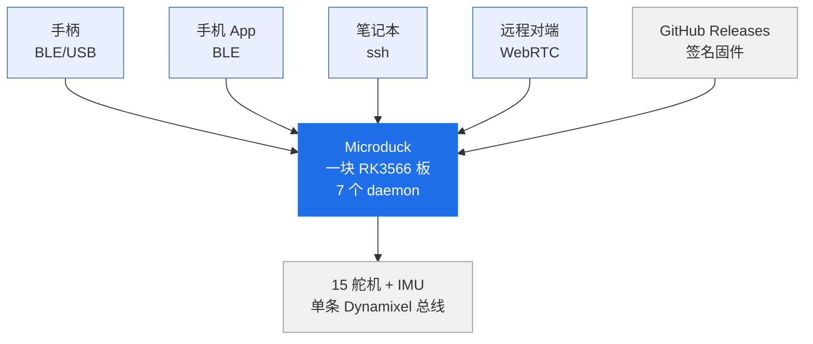
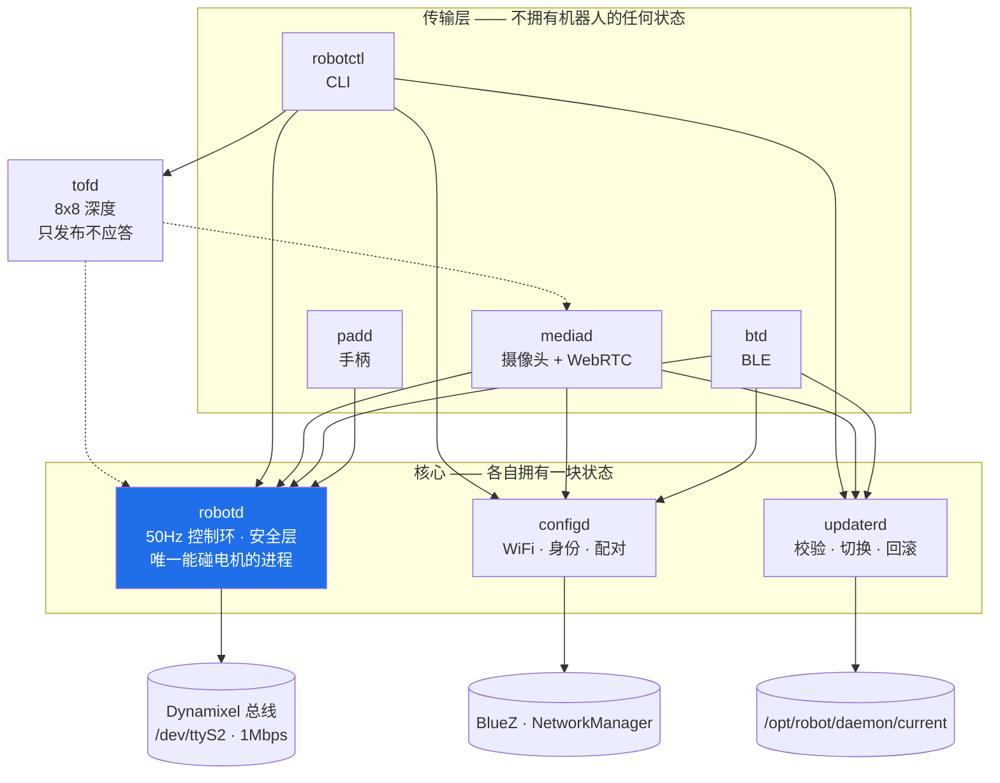
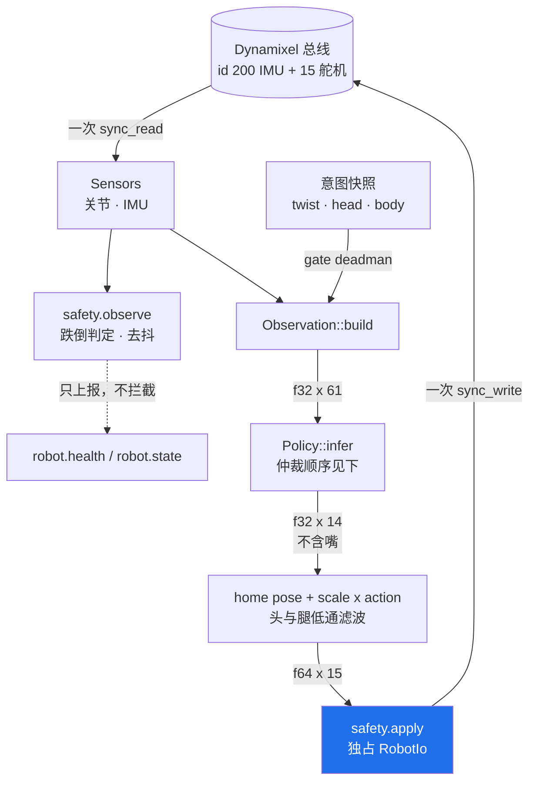
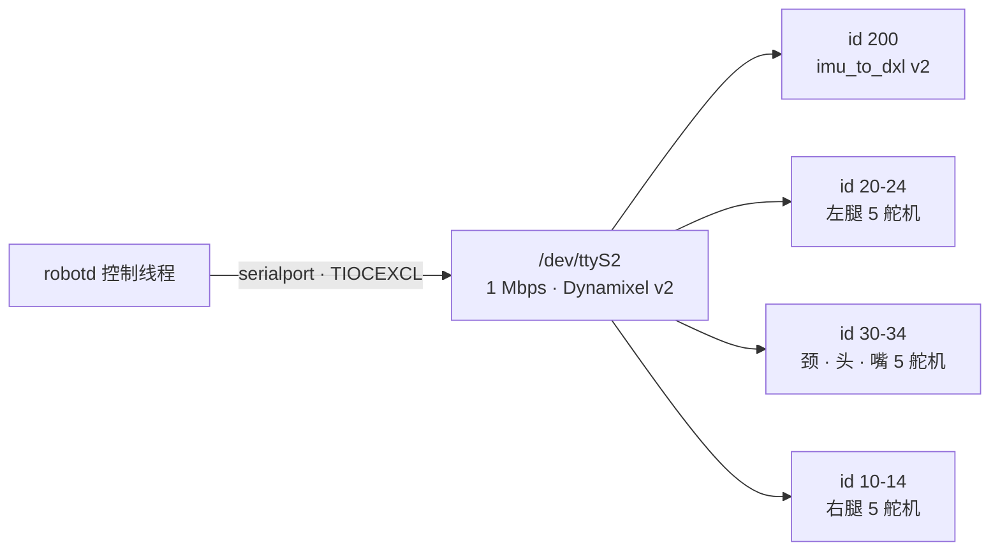
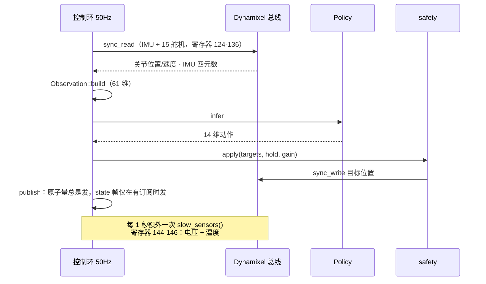
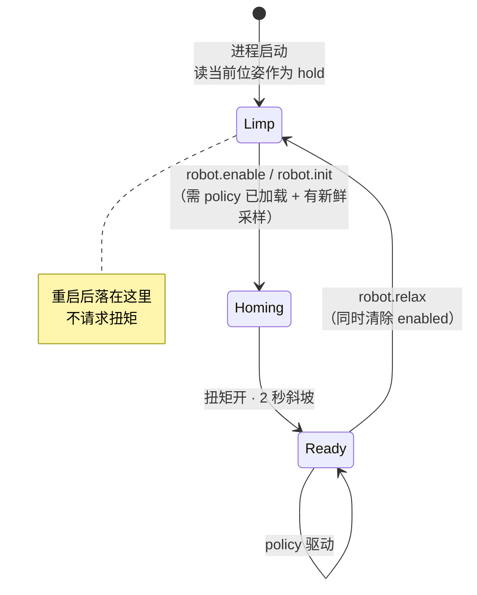
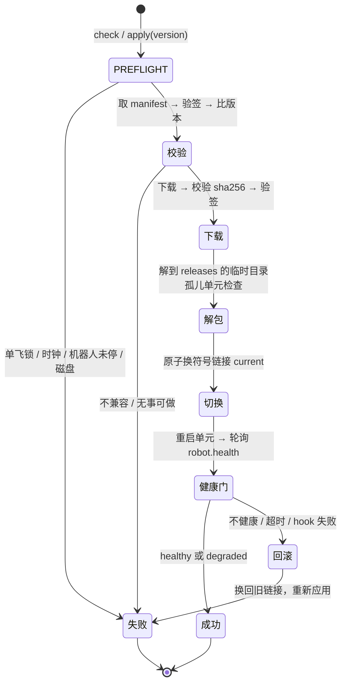

# 官方架构（C4 · 状态机 · 时序）

Microduck 官方整机的架构、状态机与时序。同目录还有 [README.md](README.md)（一页纸概览，**没读过先读它**）、[stack.md](stack.md)（技术栈）、[hardware.md](hardware.md)（硬件清单）。

**资料源**：上游 `pollen-robotics/microduck` 的 `docs/design/`（`architecture.md`、`robotd-design.md`、`updater-design.md`），另有若干条已回到源码核对。核对日期 2026-09-16。

⚠️ 本文多数内容来自官方**设计文档**而非逐行核对源码。已回源码核实的几条：`JOINT_NAMES` 是 15 元数组且 `mouth` 在索引 9（`duck-ipc-proto/src/lib.rs:436`）、串口是 `/dev/ttyS2`、控制频率 50 Hz（`robotd-params`）、舵机走 `Xl330Controller`（`duck-control/src/bus.rs:18`）。

本项目（fanhao375 路线）跑的就是这套软件，差异只在舵机型号与两块自制板 —— 见 [../rebuild/ecosystem.md](../rebuild/ecosystem.md)。

---

## 一、系统上下文（C4 L1）

## 二、七个 daemon（C4 L2）

进程间一律 **unix socket 上的 JSON-RPC 2.0，一行一个对象**（NDJSON）。

| 服务 | 拥有什么 | 监听 | 对外连接 |
|---|---|---|---|
| `robotd` | 电机控制、传感、策略、安全、`robot.health` | `/run/robotd.sock` | Dynamixel 总线 |
| `configd` | WiFi、身份与名称、配对 PIN、手柄绑定、重启 | `/run/configd.sock` | BlueZ、NetworkManager（D-Bus） |
| `updaterd` | 发布：校验、安装、切换、健康门、回滚 | `/run/updaterd.sock` | GitHub Releases、`systemctl`、`robotd` |
| `btd` | 无 —— BLE 传输 | BLE GATT 服务 | `robotd`、`configd`、`updaterd` |
| `padd` | 无 —— 手柄传输 | `/run/padd/pad.sock` | `robotd` |
| `mediad` | 摄像头与音频管线 | `:8080` PNG、`:8443` 信令、`/run/mediad/media.sock` | `robotd`、`configd`、`updaterd` |
| `tofd` | 头部 ToF，8×8 深度矩阵 | `/run/tofd/tof.sock` | HAT 的 I²C |
| `robotctl` | 无 —— CLI，必须能在坏掉的机器人上工作 | — | 以上全部 |

### 三条支撑整个架构的决策

1. **只有 `robotd` 能碰电机。** 客户端发的是*意图*（"这么快走"、"看那边"），`robotd` 的安全层决定什么真正可执行。
2. **`configd` / `updaterd` / `btd` 能在 `robotd` 死后存活** —— 对它无 systemd 依赖，也不加载 ML 运行时与媒体栈。原话是：控制环起不来的机器人，正是最需要被重配、更新、回滚的那台。
3. **发布整体替换而非打补丁。** 一个版本落成 `releases/<版本>/` 整个目录，切 `current` 符号链接，再问 `robotd` 健不健康；不健康就自己换回去。

### 状态存放在哪

| 位置 | 内容 |
|---|---|
| `/etc/robot/robotd.toml`、`updater.toml` | 逐板配置，安装器写一次、永不覆盖 |
| `/var/lib/robot/config/config.json` | 机器人名与配对 PIN，`configd` 所有 |
| NetworkManager profiles | WiFi 凭据 —— **官方从不自行存储** |
| `/opt/robot/daemon/releases/<版本>/` | 二进制、策略、出厂默认值，原子替换 |
| `/opt/robot/daemon/current` | 指向当前版本的符号链接 |
| `/run/<服务>/identity.json` | 每个 daemon 启动时发布自己实际在跑什么 |

**`releases/<版本>/` 之外的一切都能扛过更新与回滚。** 这就是全部规则，也是逐板配置不随发布下发的原因。

---

## 三、`robotd` 内部（C4 L3）

一个进程、一条串口总线、一个 50 Hz 环。环读全部 16 个设备（**一次** `sync_read`），算出 15 个关节目标，写回去。其余一切挂在环外，不能阻塞它。

⚠️ **跌倒判定只上报，不拦截任何东西。** `safety.apply` 做的是拒绝非有限值、钳到行程范围 —— 没有跌倒门。躺在地上按 Start 就是让它站起来的正常方式。

**policy 仲裁顺序**（先到先得）：`roulade` > `kick` > `ground pick` > `sit/rise` > `stand`（按 |twist| 或强制）> `walk`。

### 总线归属

**IMU 排在 id 向量第一位**，好让它在舵机爆发式应答之前先回。它和 15 个舵机在**同一次 `sync_read`** 里被读出 —— v2 板挂在总线上，从舵机应答的同一段寄存器里吐出片内 SFLP 四元数。一块板、一条代码路径、没有 IMU 抽象层。

**同时只能有一个持有者**，而 tty 独占标志本身不够：`serialport` 设了 `TIOCEXCL`，但 `robotd.service` 以 root 运行，root 不受该标志约束。所以 daemon 与独立 `init` 共享一把咨询锁。

⚠️ **`serial-getty@ttyS2` 会抢总线。** Armbian 默认在 UART2 上跑登录控制台，`agetty` 占着口会让所有舵机对其他进程**完全不可见**。官方 `setup-board.sh` 屏蔽了这个 unit；`fuser -v /dev/ttyS2` 是查"谁占着总线"的命令。

---

## 四、时序：一个 tick

50 Hz，一个 `tokio` 任务跑在自己的 runtime 上，IPC 工作排不到它前面。每 tick 两次总线事务，外加每秒一次慢速采样。

`tokio` 的 `interval` 用 **`MissedTickBehavior::Skip`**：

- `Burst` 会把积压的 tick 连发，把电机指令摞在一起
- `Delay` 更隐蔽 —— 它在每个 tick 之后把下次安排在 *now + period*，于是每次唤醒延迟都加进周期而不是被吸收，环比配置频率越跑越慢
- `Skip` 保持原定时刻表、丢掉错过的 tick，这才是控制环要的

---

## 五、状态机：上电与使能

**`robotd` 从不自己让机器人动。** 启动时读当前位置、把它当作目标、不碰扭矩。Dynamixel 在进程死掉期间保持最后下发的目标，所以重启后位姿不变、没有空档 —— 机器人能在更新期间一直站着。

两个前置条件各有理由：

- **policy 已加载** —— `enable` 的含义是"启用 policy"；为一个加载不了的策略上电，等于把机器人在坏版本上扶起来然后一直扶着
- **有新鲜采样** —— 斜坡从关节当前位置起步，从没人读过的位置起步正是斜坡要避免的那一下猛弹

**"摔倒"不是前置条件。** 躺在地上按 Start 正是让它站起来的方式。

`driving` 需要**四个条件同时成立**：`enabled` ∧ `policy 已加载` ∧ `本 tick 有传感器数据` ∧ `¬limp-fall`。其中"本 tick 有传感器数据"最不显然 —— 读失败就没有东西能拼观测，编一个等于喂给 policy 一台不存在的机器人。

状态切换的边沿各有动作：

- **开始驱动** → `controller.reset()`，否则陈旧的上次动作、或锚在一分钟前位置的滤波器，会表现为一次抽搐
- **停止驱动** → 抓一次当前位姿存为 `hold`；每 tick 重读会因重力而下垂

---

## 六、状态机：更新与回滚

任何非零 hook 退出、健康探测失败或超时，处理方式**完全一致：中止并回滚**。

⚠️ **`degraded` 也提交，不回滚。** 理由很硬：没有舵机供电的 `robotd` 在旧版上一样失败 —— 在这里回滚等于把硬件故障藏在一次软件变更后面，还会连带把下一个版本也回滚掉，更糟的是在拿着机器人的人毫不知情的情况下替换了代码。

另有两道兜底，针对硬挂而非干净失败：

- systemd 的 `WatchdogSec` 挂在 `robotd` 上，卡死即触发恢复
- **启动计数器**：如果上一次更新跨 2 次启动都没到达 healthy，就去问机器人再决定。同样是三分法 —— *healthy* 提交、*degraded* 提交、其余回滚

`keep_previous`（默认 1）限制保留的旧版本目录数，同时保证总有一个已知良好的回滚目标。
