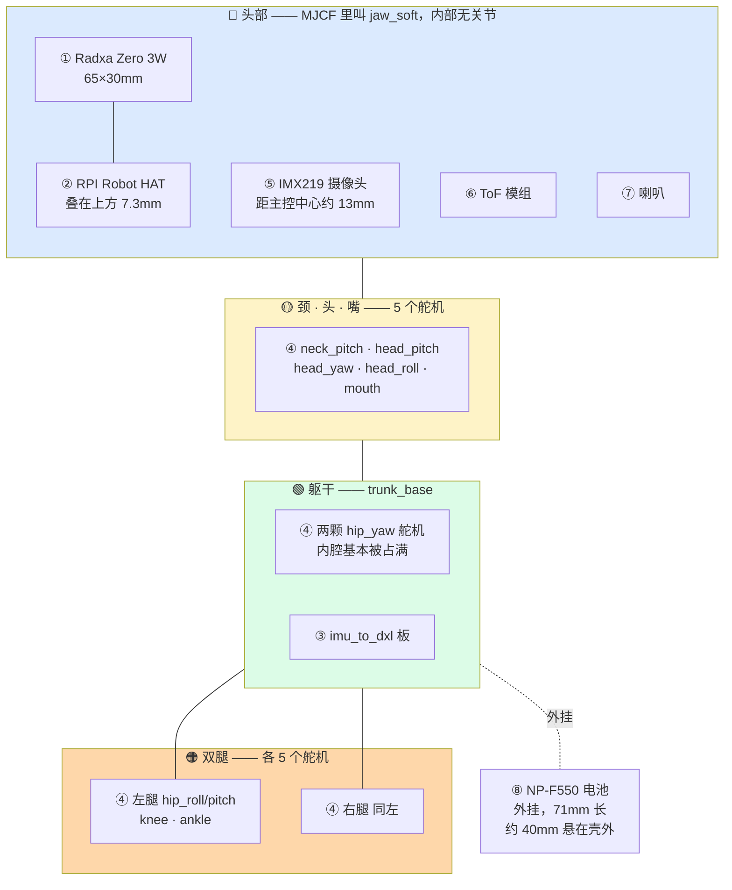
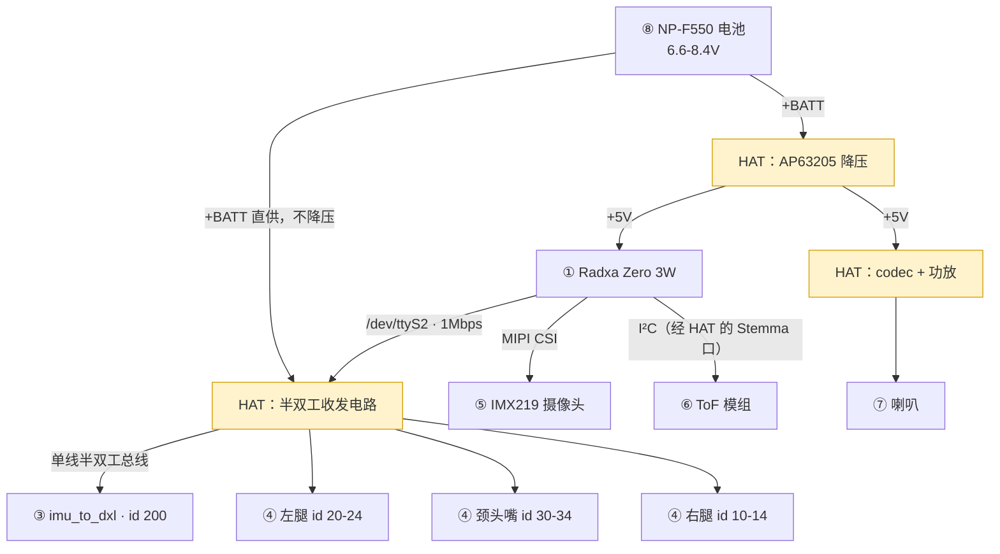

# 官方硬件清单

核对日期 2026-09-16。**证据分三级**，这个区分很重要 —— 官方从未发布机械与电子设计文件（HAT 除外），所以很多数据是社区反推的。

| 标记 | 含义 |
|---|---|
| ✅ | **官方源码/仓库直接读到** |
| 📄 | 官方设计文档所述 |
| 🔍 | **社区逆向推导**，未经官方确认 |

---

## 〇、硬件总览 —— 先看这张

⚠️ **下面每一行是一个「可以单独买到或做出来」的实体**，不是功能块。整机就这 11 样。

| # | 部件 | 数量 | 装在哪 | 怎么来 | 干什么 |
|---|---|---|---|---|---|
| 1 | **Radxa Zero 3W** | 1 | 头 | 🛒 买 | 主控。跑 Linux、7 个 daemon、神经网络、视觉 |
| 2 | **RPI Robot HAT** | 1 | 头，叠在主控上方 7.3mm | 🏭 **打样** | 配电 + 音频 + 舵机总线收发。✅ 官方开源 KiCad |
| 3 | **`imu_to_dxl` 板** | 1 | 躯干 | ✏️ **自画 + 打样** | 把 IMU 伪装成总线上的第 16 个设备。❌ 官方从未发布 |
| 4 | **Dynamixel XL330 舵机** | **15** | 腿 10、颈头嘴 5 | 🛒 买 | 15 个关节。**整机成本大头** |
| 5 | **IMX219 摄像头 + M12 镜头** | 1 | 头 | 🛒 买 | 眼睛。⚠️ 转 90° 安装 |
| 6 | **ToF 模组**（VL53L8CX） | 1 | 头 | 🛒 买 | 8×8 区测距。⚠️ 不是激光雷达 |
| 7 | **喇叭** | 1 | 头 | 🛒 买 | 发声。经 HAT 上的功放驱动 |
| 8 | **NP-F550 电池** | 1 | 机身后下方，外挂 | 🛒 买 | 供电。2S，6.6–8.4V |
| 9 | **微型轴承** | 14 | 关节处 | 🛒 买 | 转动支撑。11× Ø22×16×4 + 3× Ø15×10×3 |
| 10 | **M2 紧固件** | ~325 | 全身 | 🛒 买 | 固定 |
| 11 | **3D 打印结构件** | ~47 种 | 全身 | 🖨️ 打印 | 骨架与外壳 |

**要自己做的只有三样**：HAT 打样、`imu_to_dxl` 打样、结构件打印。其余全是买现成的。

### ⚠️ 别把「芯片」当成「要买的件」

本文后面会出现 `AP63205`、`TLV320AIC3104`、`PAM8406`、`LM5050-1`、`SIT3088`、`BMI088` 这些型号 —— **它们全都是 HAT 板上的贴片芯片**，属于上表第 2 行的一部分，不是另外 6 个要单独采购的东西。

打样 HAT 时这些器件会跟着 BOM 一起贴上去；你不会单独买它们。同理 `imu_to_dxl` 板上的 `STM32G031`、`LSM6DSV16X`、`SN74LVC2G241` 也属于第 3 行。

---

## 〇之二、物理布局



⚠️ **穿过脖子的只有两样**：舵机总线（1 对线）与电池供电线。**摄像头排线不过脖子** —— 摄像头与主控同在头部这一个刚体里，中间没有关节，所以 MIPI 排线买最短的就够。

真正的线束疲劳风险在**过颈的那两样**上 —— 那是承流线，比信号排线更值得重视。⚠️ 官方**没有公开任何走线资料**。

---

## 〇之三、电气连接



**三条要看懂的**：

1. **舵机吃的是电池原压，不是 5V。** ⚠️ 电池 `+BATT` 直接接到舵机接口，板上唯一的降压（AP63205）输出的 5V 是给主控的 —— 这就是 XL330 超压运行的来源。
2. **一条总线挂 16 个设备。** 15 个舵机 + `imu_to_dxl`（id 200），IMU 排第一位，**同一次 `sync_read` 全部读回**。
3. **摄像头走 MIPI，ToF 走 I²C，舵机走串口** —— 三条独立通路，互不干扰。

---

## 一、整机

| 项 | 值 | 证据 |
|---|---|---|
| 高度 / 重量 | ~25 cm / ~800 g | ✅ 官方 README |
| 关节数 | **15** | ✅ `duck-ipc-proto/src/lib.rs:436` 的 `JOINT_NAMES` 是 15 元数组 |
| 控制频率 | **50 Hz** | ✅ `robotd-params` 默认 `hz = 50` |
| 售价 | $399 | ✅ 官方产品页 |

### ✅ 十五个关节的确切名称与顺序

直接读自 `duck-ipc-proto`，**顺序即协议** —— 状态流里 `joints` 和 `targets` 是裸数组：

```
0  left_hip_yaw      5  neck_pitch     10  right_hip_yaw
1  left_hip_roll     6  head_pitch     11  right_hip_roll
2  left_hip_pitch    7  head_yaw       12  right_hip_pitch
3  left_knee         8  head_roll      13  right_knee
4  left_ankle        9  mouth          14  right_ankle
```

⚠️ **`mouth` 在索引 9。** 策略输出 **14 维不含嘴**，但总线上写回 15 个目标 —— 嘴由独立逻辑驱动。

---

## 二、主控

| 项 | 值 | 证据 |
|---|---|---|
| SoC | Rockchip **RK3566** | ✅ 官方 README |
| 板卡 | **Radxa Zero 3W** | 🔍 社区从设备树 `compatible = "radxa,zero-3w"` 反推 |
| 形态 | 65 × 30 mm，树莓派 Zero 形态，40 针 | 🔍 |
| NPU | 0.8–1 TOPS INT8 | 🔍 ⚠️ Armbian 默认关闭 |
| 串口 | **`/dev/ttyS2`** | ✅ `robotd-params` 默认值 |

🔍 **它是市售模块不是定制载板** —— 这条对复刻很关键，意味着主控不用自己做。

---

## 三、RPI Robot HAT（唯一官方开源的板）

✅ 仓库 `pollen-robotics/elec_RPI_Robot_HAT`，**KiCad 9**，含 `main.kicad_sch` / `audio.kicad_sch` / `dynamixel.kicad_sch` / `.kicad_pcb` 与每颗主要器件的 datasheet。

✅ **README 原文的定位**：「a raspberry pi HAT designed for small/medium size robots」——**这是一块通用板，不是 Microduck 专用**。

✅ 它提供四样东西：

| 功能 | 说明 |
|---|---|
| **IMU** | 走 I²C |
| **舵机通信** | **TTL 与 485 两种**，原文：*"to drive **Dynamixel/Feetech** motor (requires cable adaptation)"* |
| **音频** | 输入输出，板载 MEMS 麦克风；Wago 端子可外接喇叭与额外麦克风 |
| **扩展** | Qwiic 接口，1mm / 3V3 |

✅ 供电 **5–28 V**，设计上用电机接口作为电源输入。

### ⚠️ 两条容易误读的

**一、HAT 硬件两家舵机都能驱动，但官方软件只实现了 Dynamixel。**
✅ `duck-control/src/bus.rs:18` 是全仓唯一的舵机导入：`use rustypot::servo::dynamixel::xl330::Xl330Controller;`，结构体叫 `DynamixelIo`，`feetech`/`sts3215` 在总线层命中 0 次。**换飞特要改软件，不只是换线。**

**二、HAT 是按树莓派 Zero 设计的，Microduck 配的是 Radxa。**
✅ 仓库 docs 里放的是 **Raspberry Pi Zero 2 W 的规格书与简化原理图**，README 说「Its size fits a Raspberry PI zero」。Radxa Zero 3W 只是同形态的替换。

### ✅ 板上主要器件（从 datasheet 文件名读出）

| 器件 | 作用 |
|---|---|
| **AP63205** | 降压（buck） |
| **LM5050-1** | 理想二极管 |
| **XC6202** | LDO |
| **TLV320AIC3104** | 音频 codec |
| **PAM8406** | 功放 |
| **BMI088** | IMU |
| **SIT3088** | RS-485 收发器 |
| **CAT24C32** | EEPROM（HAT 身份识别） |
| LMA2718 | 🔍 未核对用途 |

🔍 **BMI088 焊了但官方运行时不用** —— Microduck 的 IMU 在 `imu_to_dxl` 板上（见下）。
⚠️ 但 Pollen 生态里确有代码读它：Marc Duclusaud 的部署代码依赖 `pollen_bmi088_imu_library`。**同一块 HAT，不同项目用不同的 IMU。**

---

## 四、`imu_to_dxl` 板

❌ **官方从未发布这块板的任何设计文件。** 以下全部来自社区逆向。

🔍 名字就是功能：`imu` → `dxl`（Dynamixel）。板上一颗小 MCU 对内用 SPI 读 IMU，对外**伪装成第 16 个舵机**（id 200），主控用读舵机寄存器的方式拿姿态。

🔍 好处：姿态与 15 个舵机在**同一次 `sync_read`** 里读回，不额外占总线、不占主控算力（IMU 片内 SFLP 直接出四元数）。

| 器件 | 🔍 社区重建的选型 |
|---|---|
| MCU | STM32G031F8P6 —— USART 带**硬件 DE**（1 Mbps 下一个比特只有 1 µs，软件翻方向脚的抖动就在这量级） |
| IMU | LSM6DSV16X —— 片内 SFLP 融合 |
| 收发 | SN74LVC2G241 —— 双缓冲做单线半双工 |

⚠️ **这是复刻的最高风险单点。** 有两份独立社区重建（fanhao375、pablo-mano），**都未流片验证**。

---

## 五、舵机

| 项 | 值 | 证据 |
|---|---|---|
| 协议 | **Dynamixel Protocol 2.0** | ✅ `rustypot` 依赖注释提到 `FF FF FD`（2.0 包头） |
| 型号 | **XL330** | ✅ `Xl330Controller` |
| 具体后缀 | XL330-**M288-T** | 🔍 源码只有 `xl330`，后缀是社区从力矩推断 |
| 数量 | 15 | ✅ `JOINT_NAMES` |
| 总线 | 单条，1 Mbps | 📄 |
| ID 分配 | 左腿 20–24 / 颈头嘴 30–34 / 右腿 10–14；IMU 板 id 200 | 📄 设计文档 |

### ⚠️ XL330 被超压运行

🔍 社区从官方 HAT 原理图查实：三个 Dynamixel 接口的电源脚**直接接 `+BATT`**，板上唯一的降压（AP63205）输出的 5V 是给主控的。

| | 值 |
|---|---|
| XL330 官方额定 | **3.7 – 6.0 V**（推荐 5.0） |
| 实际母线 | **6.6 – 8.2 V** |

🔍 判断：Pollen 用发热与寿命换力矩 —— 这大概是 18 g 舵机能扛 800 g 整机的原因之一。

---

## 六、传感器

| 器件 | 作用 | 证据 |
|---|---|---|
| IMX219 | 摄像头（树莓派 Camera v2 那颗） | 🔍 ⚠️ **转 90°** 安装，不是倒装 180° |
| VL53L8CX / VL53L5CX | ToF，**8×8 区测距** | 🔍 ⚠️ **不是激光雷达** |
| LSM6DSV16X | IMU，在 `imu_to_dxl` 上 | 🔍 |
| MEMS 麦克风 | 板载 | ✅ HAT README |

---

## 七、电源与结构

| 项 | 值 | 证据 |
|---|---|---|
| 电池 | Sony **NP-F550**（2S，6.6–8.4 V） | 🔍 ⚠️ 上游网格文件名叫 `np_f970` 但实测尺寸是 F550 |
| 轴承 | 14 个：11× Ø22×16×4 + 3× Ø15×10×3 | 🔍 数自 MJCF geom 引用 |
| 紧固件 | 约 325 件，M2 体系 | 🔍 从 47 个 STL 的孔特征反推 |
| 刚体 / 网格 | 15 / 47 | 🔍 |

🔍 **`bearing_roll` 不是轴承**，是轴承压盖，要打印不用买。

---

## 八、⚠️ 复刻时最容易搞错的五条

1. **主控在头里，不在躯干** —— 直接决定买多长的排线
2. **没有激光雷达** —— ToF 是 8×8 区测距模组
3. **音频不是独立模块** —— codec、功放、麦克风全在 HAT 上
4. **HAT 能驱动飞特，但官方软件不能** —— 换舵机要改软件
5. **仿真 STL 不是制造文件** —— 几何对，但没有公差、配合间隙、打印收缩
