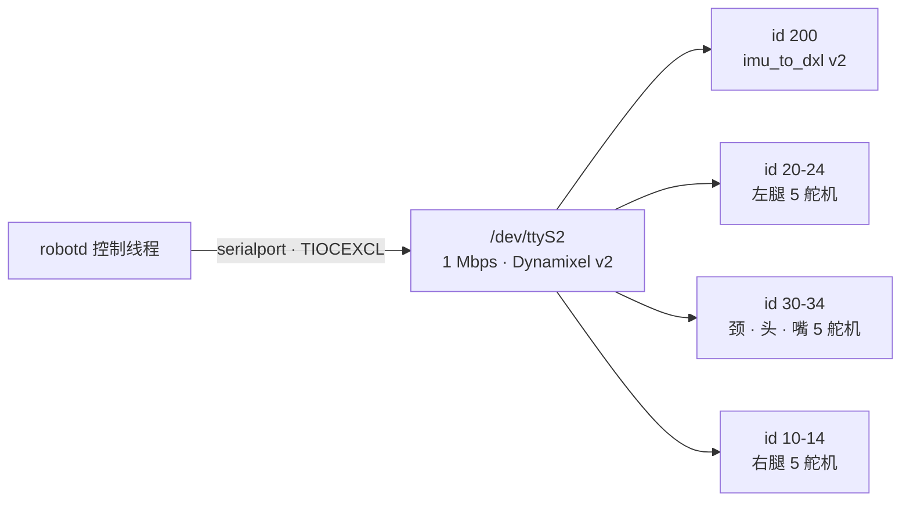
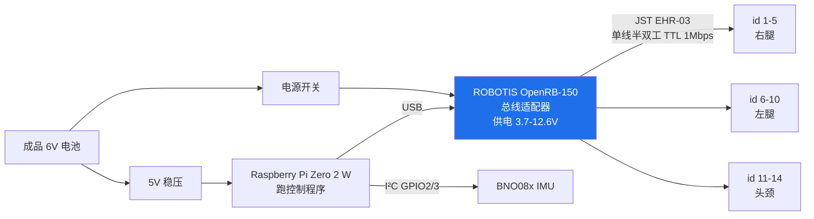

# hardware/ AGENTS.md

## 产品

机械与电子的逆向线。官方**没有**发布设计文件，这里是真逆向。

无实机，无基准件可对照 —— 所有尺寸与电气细节只能靠社区逆向成果加官方仿真模型推导。阶段规划与难点分析见 `README.md`，此处不重复。

## 技术

| 用途 | 工具 | 状态 |
|---|---|---|
| 机械 CAD | **SolidWorks** | 与 `fanhao375/microduck-replica-cad` 对齐 —— 目前唯一公开的完整可编辑模型 |
| PCB | **嘉立创EDA 专业版** | 与 `fanhao375/microduck-replica` 的 `imu_to_dxl` 工程（`.eprj2`）对齐 |
| PCB（官方件） | KiCad | 官方 Robot HAT 本身是 KiCad 工程，用到时单独开 |
| 制造 | 3D 打印 + PCB 打样 | 材料与工艺未定 |

选型依据是**与社区可编辑源对齐**，不是工具本身更好 —— 换工具就意味着放弃直接复用那些文件。⚠️ SolidWorks 是商业软件；⚠️ `microduck-replica-cad` 无许可证声明，使用前需取得授权。详见 `../docs/ecosystem.md`。

## 结构

需要自制的与不需要的，分清楚：

| 部件 | 是否需要复刻 |
|---|---|
| 主控板 Radxa Zero 3W (RK3566) | **否** —— 现成模块，直接买 |
| RPI Robot HAT | **否** —— 官方已开源完整 KiCad + gerber + BOM + pick-place |
| 电池 Sony NP-F550 | **否** —— 摄像机通用电池 |
| 传感器（IMX219 / VL53L8CX / LSM6DSV16X） | **否** —— 均为常见型号 |
| 结构件（15 刚体 / 47 网格 / ~325 M2 紧固件） | **是** —— 需公差迭代 |
| `imu_to_dxl` 板 | **是** —— 官方未发布，风险最高的单点 |
| 线束 | **是** —— 完全无文档 |

### 官方总线拓扑

整机只有**一条**串口总线，没有第二条。资料源为上游 `docs/design/robotd-design.md` §1.1。

**IMU 排在 id 向量第一位**，好让它在舵机爆发式应答之前先回。它和 15 个舵机在**同一次 `sync_read`** 里被读出 —— 因为 v2 板就挂在 Dynamixel 总线上，从舵机应答的同一段寄存器里吐出片内 SFLP 四元数。一块板、一条代码路径、没有 IMU 抽象层。

⚠️ **串口控制台会抢总线。** Armbian 默认在 UART2 上跑登录控制台，`agetty` 占着口会让所有舵机对其他进程**完全不可见**。官方的 `setup-board.sh` 屏蔽了这个 unit；`fuser -v /dev/ttyS2` 是查"谁占着总线"的命令。

### 本项目的拓扑（AI-FanGe 路线）

⚠️ **与上面不是同一套。** 官方把半双工收发电路集成在 HAT 上；本路线用现成的 OpenRB-150 经 USB 接主控，IMU 另走 I²C。

与官方拓扑的三处关键差异：

| | 官方 | 本路线 |
|---|---|---|
| 总线适配器 | 集成在自制 HAT 上 | **现成的 OpenRB-150**，零自制 PCB |
| IMU 挂在哪 | Dynamixel 总线上（id 200，与舵机同一次 `sync_read`） | **独立 I²C**，与舵机总线无关 |
| 舵机 ID | 左腿 20–24 / 颈头嘴 30–34 / 右腿 10–14 | **1–14 顺序编号**，无嘴 |

⚠️ 两套 ID 表**不通用**。完整的路线对比见 `../docs/ecosystem.md`。

## 目录地图

| 文件 | 内容 |
|---|---|
| `README.md` | 阶段规划、难点、参考项目 |
| `bom.md` | BOM 草稿。数量来自对官方 MJCF geom 引用的统计，**未经验证**；价格待填 |

## 约定

**本目录许可证与仓库其余部分不同。** 见本目录 `LICENSE`：这里是 CC BY-NC-SA 4.0，仓库根是 Apache-2.0。原因是从官方 MJCF/STL 衍生的 CAD 受 ShareAlike 条款强制继承 —— 上游模型的版权不属于本项目，无权为其衍生物换证。

**分清几何与事实。** 受 CC 约束的只有衍生几何（CAD、网格、装配图纸）。尺寸数值、元件型号、BOM 数量、独立测量、文字描述都是事实，不构成衍生作品，适用根目录 Apache-2.0 —— 所以 `bom.md` 和本文件都不受 CC 约束。自行从零绘制、未参考官方模型的零件同理，但要能说明独立来源。

**仿真 STL 不是制造文件。** 官方 47 个 STL 几何正确，但没有公差、没有配合间隙、没考虑打印收缩。任何"直接打印即可装配"的判断都是错的。

**未验证的东西必须标 `⚠️`。** 尤其是 `imu_to_dxl`（社区重建版从未流片）、IMU 数量（来源冲突）、NFC/麦克风/扬声器型号（未公开）。无实机意味着这个仓库里绝大多数硬件数据都是推导而非实测 —— 抹平这个区别会让后来者踩坑。

**BOM 数量要标来源。** 现有数量来自 MJCF geom 引用统计，是实数不是估算；下单前仍需自行核实。改动数量时说明依据。
