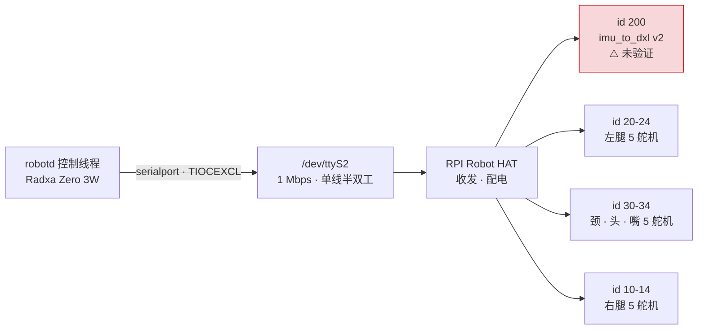

# hardware/ AGENTS.md

## 产品

机械与电子的逆向线。官方**没有**发布设计文件，这里是真逆向。

无实机，无基准件可对照 —— 所有尺寸与电气细节只能靠社区逆向成果加官方仿真模型推导。

参考路线 `fanhao375/microduck-replica`：舵机用国产飞特 HD-1910，两块板自己打样。阶段规划与难点见 `README.md`，此处不重复。

## 技术

| 用途 | 工具 | 状态 |
|---|---|---|
| 机械 CAD | **SolidWorks** | 与 `fanhao375/microduck-replica-cad` **v2.0 飞特版**对齐（文件带 `-FT` 后缀） |
| PCB | **嘉立创EDA 专业版** | 与 `fanhao375/microduck-replica` 的 `imu_to_dxl` 工程（`.eprj2`）对齐 |
| PCB（官方件） | KiCad | 官方 Robot HAT 本身是 KiCad 工程，用到时单独开 |
| 制造 | 3D 打印 + PCB 打样 | 材料与工艺未定 |

选型依据是**与社区可编辑源对齐**，不是工具本身更好 —— 换工具就意味着放弃直接复用那些文件。⚠️ SolidWorks 是商业软件；⚠️ `microduck-replica-cad` 无许可证声明，使用前需取得授权。详见 `../docs/ecosystem.md`。

## 结构

整机的总线归属、`robotd` 与硬件的交互见 [../docs/architecture.md](../docs/architecture.md)。本节只讲**本路线的硬件形态**。

### 自制与采购的分界

| 部件 | 怎么来 |
|---|---|
| 主控 Radxa Zero 3W (RK3566) | 🛒 **买** —— 现成模块，65×30mm，就是按头壳里那个槽设计的 |
| 电池 Sony NP-F550 | 🛒 **买** —— 摄像机通用电池，2S，6.6–8.4V |
| 传感器 IMX219 / VL53L8CX / LSM6DSV16X | 🛒 **买** —— 均为常见型号 |
| 舵机 飞特 HD-1910-C001 ×15 | 🛒 **买** —— ⚠️ 非官方 XL330 |
| **RPI Robot HAT** | 🏭 **自己打样** —— 官方已开源完整 KiCad + gerber + BOM + 贴片坐标，照打即可 |
| **`imu_to_dxl` 板** | ✏️ **自己画/打样** —— ⚠️ 官方从未发布，社区重建版**未经流片验证**。全项目风险最高的单点 |
| 结构件 | 🖨️ **打印** —— ⚠️ 飞特版 **8 个配合件要改模**（HD-1910 舵盘凸、XL330 凹） |
| 线束 | ✏️ **自己做** —— ⚠️ 官方无任何走线资料 |

### 本路线的总线拓扑

**IMU 排在 id 向量第一位**，与 15 个舵机在**同一次 `sync_read`** 里读出 —— `imu_to_dxl` 板挂在总线上，从舵机应答的同一段寄存器里吐出片内 SFLP 四元数。一块板、一条代码路径、没有 IMU 抽象层。

### 飞特带来的三处硬件差异

| | 官方 XL330 | 本路线 HD-1910 | 影响 |
|---|---|---|---|
| **接头间距** | 2.5mm | **2.0mm** | `imu_to_dxl` 板上 J4/J5 是 2.0 的座子，两套并存 |
| **脚序** | `1=GND / 2=Vcc / 3=Signal` | **完全相反** | ⚠️ **接错电源脚会烧。** 好在间距不同插不进对方，只剩"自己压线时压反"这一种可能 —— 压完先用万用表点一遍 |
| **舵盘** | 凹 | **凸** | ⚠️ **8 个配合件要改模重打**。fanhao375 已出飞特版 SolidWorks 图纸（`-FT` 后缀）与一键打印 |

⚠️ **电压零余量。** HD-1910 工作范围 4–8.4V，NP-F550 满电正好 8.4V。带载压降到 6.6–8.2V 才回到安全区 —— **刚充满别直接堵转测试**，装机前把舵机的过压保护打开（出厂默认关闭）。

⚠️ **串口控制台会抢总线。** Armbian 默认在 UART2 上跑登录控制台，`agetty` 占着口会让所有舵机对其他进程**完全不可见**。官方 `setup-board.sh` 屏蔽了这个 unit；`fuser -v /dev/ttyS2` 查"谁占着总线"。

## 目录地图

| 文件 | 内容 |
|---|---|
| `README.md` | 阶段规划、难点、参考项目 |
| `bom.md` | BOM 草稿。数量来自对官方 MJCF geom 引用的统计，**未经验证**；价格待填 |

## 约定

**本目录许可证与仓库其余部分不同。** 见本目录 `LICENSE`：这里是 CC BY-NC-SA 4.0，仓库根是 Apache-2.0。原因是从官方 MJCF/STL 衍生的 CAD 受 ShareAlike 条款强制继承 —— 上游模型的版权不属于本项目，无权为其衍生物换证。

**分清几何与事实。** 受 CC 约束的只有衍生几何（CAD、网格、装配图纸）。尺寸数值、元件型号、BOM 数量、独立测量、文字描述都是事实，不构成衍生作品，适用根目录 Apache-2.0 —— 所以 `bom.md` 和本文件都不受 CC 约束。自行从零绘制、未参考官方模型的零件同理，但要能说明独立来源。

**仿真 STL 不是制造文件。** 官方 47 个 STL 几何正确，但没有公差、没有配合间隙、没考虑打印收缩。任何"直接打印即可装配"的判断都是错的。

**未验证的东西必须标 `⚠️`。** 尤其是 `imu_to_dxl`（社区重建版从未流片）、IMU 数量（来源冲突）、NFC/麦克风/扬声器型号（未公开）。无实机意味着这个仓库里绝大多数硬件数据都是推导而非实测 —— 抹平这个区别会让后来者踩坑。

**BOM 数量要标来源。** 现有数量来自 MJCF geom 引用统计，是实数不是估算；下单前仍需自行核实。改动数量时说明依据。
