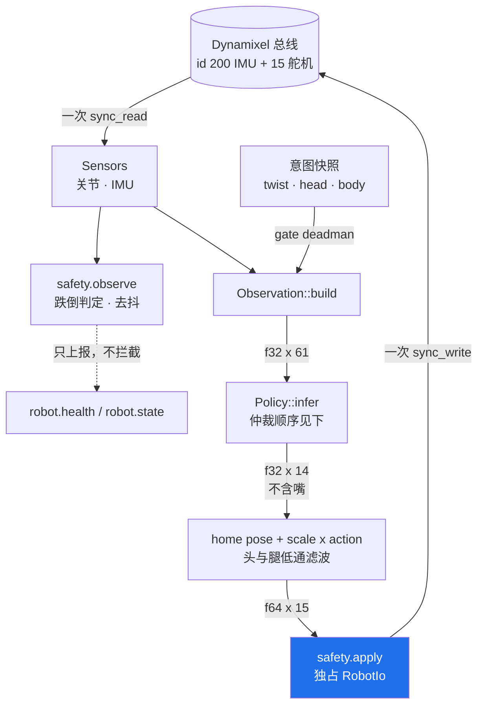
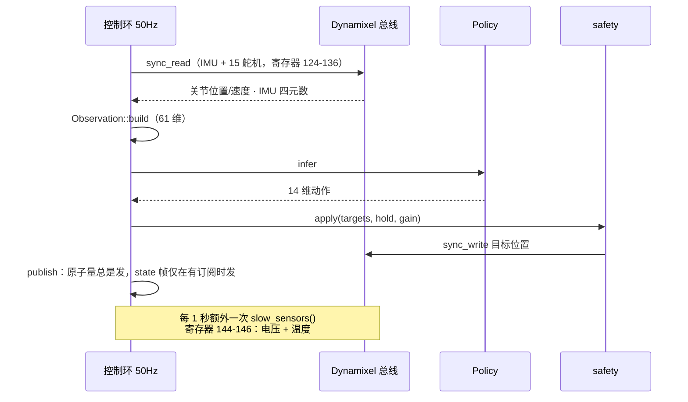
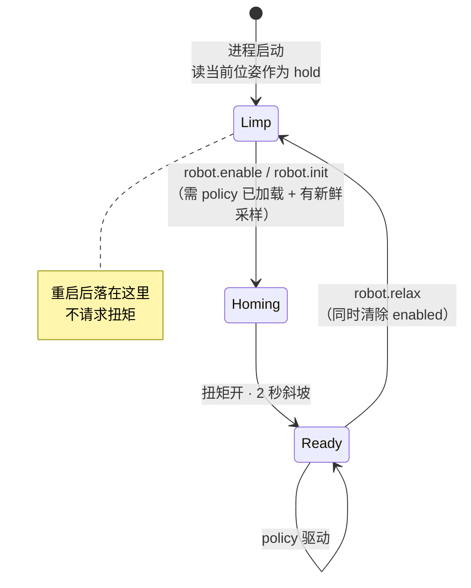
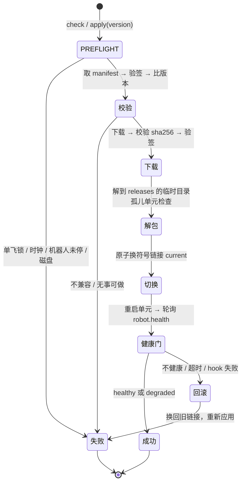

# software/ AGENTS.md

## 产品

控制栈与 RL 训练线。上游是 Apache-2.0 真开源，所以这里的工作是**吃透与改造**，不是逆向。

这条线**不依赖硬件线**：上游 `scripts/duck-sim` 让真实 daemon 跑在 MuJoCo 的身体上，无实机也能完整推进。阶段规划见 `README.md`，此处不重复。

## 技术

| 用途 | 工具 |
|---|---|
| 控制栈 | Rust（上游单 workspace） |
| RL 训练 | Python + mjlab（MuJoCo Warp），PPO @ 50 Hz |
| policy 导出 | 上游 `microduck_rl` 的 `scripts/export.py` → ONNX，观测归一化器烘焙进计算图 |
| 仿真入口 | 上游 `microduck` 的 `scripts/duck-sim` |

训练需要 **CUDA GPU**（上游称 4096 并行环境约 1–2 小时得可用步态）。无 CUDA 时的社区退路见 `README.md`。

上游不含预训练权重，只能自训或从 checkpoint 恢复；9 个出厂 ONNX policy 在 Hugging Face Hub 上单独发布。

## 结构

整机的 daemon 拓扑见根 `AGENTS.md`，此处不重复；下面是 `robotd` 内部与两个状态机。
资料源为上游 `docs/design/robotd-design.md` 与 `updater-design.md`。

### `robotd` 内部（C4 L3）

一个进程、一条串口总线、一个 50 Hz 环。环读全部 16 个设备（**一次** `sync_read`），算出 15 个关节目标，写回去。其余一切都挂在环外，不能阻塞它。

⚠️ **跌倒判定只上报，不拦截任何东西。** `safety.apply` 做的是拒绝非有限值、钳到行程范围 —— 没有跌倒门。

**policy 仲裁顺序**（先到先得）：`roulade` > `kick` > `ground pick` > `sit/rise` > `stand`（按 |twist| 或强制）> `walk`。

### 一个 tick 的时序

`tokio` 的 `interval` 用 **`MissedTickBehavior::Skip`** —— `Burst` 会把积压的 tick 连发、把电机指令摞在一起；`Delay` 会让每次唤醒延迟累加进周期，环比配置的频率越跑越慢。

### 状态机一：上电与使能

**`robotd` 从不自己让机器人动。** 启动时读当前位置、把它当作目标、不碰扭矩 —— 所以更新重启时站着的机器人会继续站着。

`driving` 需要**四个条件同时成立**：`enabled` ∧ `policy 已加载` ∧ `本 tick 有传感器数据` ∧ `¬limp-fall`。其中"本 tick 有传感器数据"最不显然 —— 读失败就没有东西能拼观测，编一个等于喂给 policy 一台不存在的机器人。

状态切换的边沿各有动作：**开始驱动** → `controller.reset()`（否则陈旧的上次动作会表现为一次抽搐）；**停止驱动** → 抓一次当前位姿存为 `hold`（每 tick 重读会因重力下垂）。

### 状态机二：更新与回滚

⚠️ **`degraded` 也提交，不回滚。** 理由是没有舵机供电的 `robotd` 在旧版上一样失败 —— 在这里回滚等于把硬件故障藏在一次软件变更后面，还会连带把下一个版本也回滚掉。

## 目录地图

| 文件 | 内容 |
|---|---|
| `README.md` | 阶段规划 |
| `POSTMORTEM.md` | 排查记录。**动手前先扫一遍**，确认不是已知问题。仅追加，绝不改已有条目 |

尚无子包 —— 代码未开始。

## 约定

**不要 vendor 上游代码。** 本仓根与上游同为 Apache-2.0，复制本身不构成许可冲突，但会丢失来源追溯、让上游更新难以合并。接入方式（submodule / fork / 脚本拉取）**尚未决定** —— 需要引用上游代码时先问，不要擅自选一种并落盘。确实要引入时，须保留上游 LICENSE 与版权声明，并按 Apache-2.0 第 4 条标注改动。

**不要假设 61 维观测的构成。** 各分量（关节位置/速度/IMU/指令）的切分与顺序尚未摸清，而这直接决定自制硬件的传感器布局能否复用出厂 policy。要用到时去读上游源码确认，别推测。

**读源码是回答硬件问题的手段。** `../docs/open-questions.md` 里有几个卡 BOM 的问题（IMU 数量、第 15 个电机）标注了"核实途径"，都指向上游源码。查到结论后回填 `../docs/`，并标注来源与日期。
