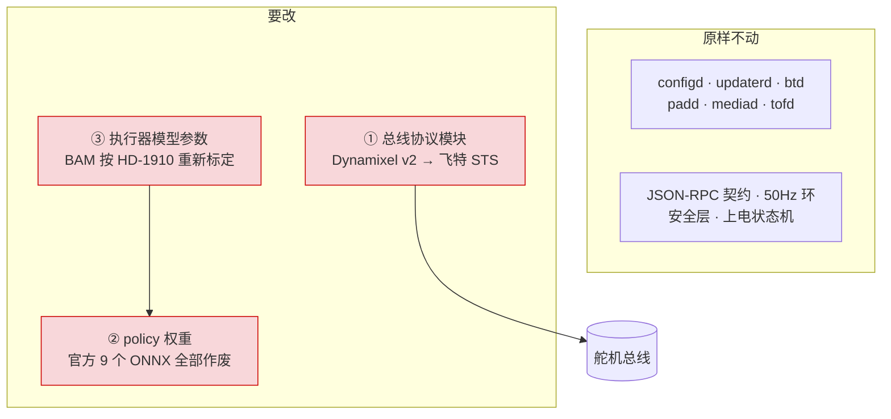
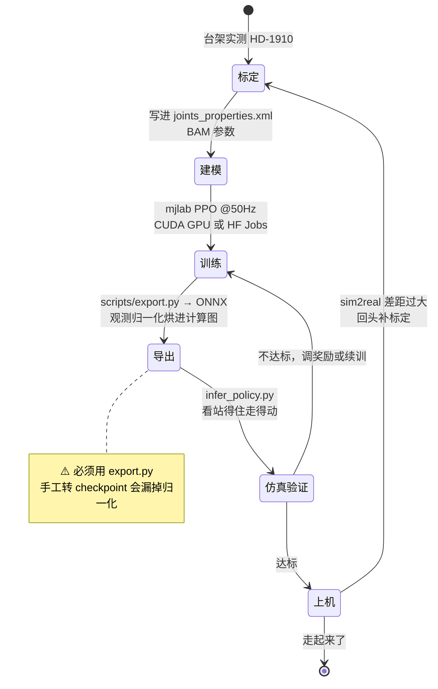

# software/ AGENTS.md

## 产品

控制栈与 RL 训练线。跑官方 Rust 栈（Apache-2.0），所以这里的工作是**吃透、改造、重训**，不是逆向。

这条线**不依赖硬件线**：官方 `scripts/duck-sim` 让真实 daemon 跑在 MuJoCo 的身体上，无实机也能完整推进。阶段规划见 `README.md`，此处不重复。

## 技术

| 用途 | 工具 |
|---|---|
| 控制栈 | Rust（上游单 workspace） |
| RL 训练 | Python + mjlab（MuJoCo Warp），PPO @ 50 Hz |
| policy 导出 | 上游 `microduck_rl` 的 `scripts/export.py` → ONNX，观测归一化器烘焙进计算图 |
| 仿真入口 | 上游 `microduck` 的 `scripts/duck-sim` |

训练需要 **CUDA GPU**（上游称 4096 并行环境约 1–2 小时得可用步态）。无 CUDA 时的社区退路见 `README.md`。

上游不含预训练权重，只能自训或从 checkpoint 恢复；9 个出厂 ONNX policy 在 Hugging Face Hub 上单独发布。

## 结构

**整机软件架构、`robotd` 内部数据流、50Hz tick 时序、上电使能与更新回滚状态机 —— 全部在 [../docs/architecture.md](../docs/official/architecture.md)。** 那是完整参考，本节不重复，只讲**本路线要动的地方**。

### 换飞特带来的三处改动

官方栈的七个 daemon 原样跑，改动集中在 `robotd` 内部这三处：

**① 协议模块。** 飞特走 STS 不是 Dynamixel v2。`rustypot` 导出了 `Sts3215PyController` / `Scs0009PyController`，但 **⚠️ 没有 HD-1910 的类**，能否复用 STS 协议未验证 —— 这是本线的第一个待验证项。

**② 策略重训。** 官方 9 个 ONNX 是在 XL330 的动力学上训出来的。⚠️ 阶段 0 已用实验确认：**接口相容不等于可用**（见 `POSTMORTEM.md`）。换执行器必须重训。

**③ 执行器模型。** 训练时 MuJoCo 里的舵机行为由 BAM 模型描述，参数是在 XL330 上辨识出来的。HD-1910 力矩 2.5 倍、减速比 1/320（XL330 是 288.4:1）、虚位 ≤0.5°（XL330 建模 ±1.0°），**必须重新标定**，其中部分项要台架实测。fanhao375 提供了《HD-1910 训练前数据清单》。

### 状态机：策略从训练到上机

本线特有的流程，官方文档没有这一段。

⚠️ **别手工转 checkpoint。** 观测归一化被烘进 ONNX 计算图（`Sub` / `Div` 算子），手工转的会让策略在运行时看到未归一化的观测。

### policy 接口契约

| | |
|---|---|
| 观测 | **61 维** = 角速度3 + 重力投影3 + 关节位置14 + 关节速度14 + 上次动作14 + **指令块13** |
| 动作 | **14 维**，不含嘴 |
| 频率 | 50 Hz |

⚠️ 出厂策略是 61 维（13 维指令块）。旧格式是 51 维（3 维指令块），`infer_policy.py` 用 `--new-cmd-obs` 切换。重训时按哪种格式要先定。

实机有 **15 个电机 ID**，第 15 个是嘴（`JOINT_NAMES[9] = "mouth"`），不进动作空间。

## 目录地图

| 文件 | 内容 |
|---|---|
| `README.md` | 阶段规划 |
| `POSTMORTEM.md` | 排查记录。**动手前先扫一遍**，确认不是已知问题。仅追加，绝不改已有条目 |

尚无子包 —— 代码未开始。

## 约定

**不要 vendor 上游代码。** 本仓根与上游同为 Apache-2.0，复制本身不构成许可冲突，但会丢失来源追溯、让上游更新难以合并。接入方式（submodule / fork / 脚本拉取）**尚未决定** —— 需要引用上游代码时先问，不要擅自选一种并落盘。确实要引入时，须保留上游 LICENSE 与版权声明，并按 Apache-2.0 第 4 条标注改动。

**换执行器就要重训，没有例外。** 阶段 0 用实验证过：策略权重编码的是它训练时那具身体的动力学，维度对得上只说明能加载。见 `POSTMORTEM.md` 第二条。

**读源码是回答硬件问题的手段。** `../docs/open-questions.md` 里有几个卡 BOM 的问题（IMU 数量、第 15 个电机）标注了"核实途径"，都指向上游源码。查到结论后回填 `../docs/`，并标注来源与日期。
